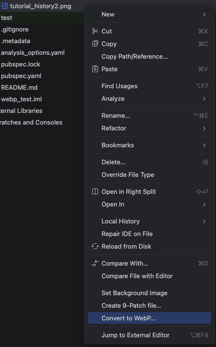
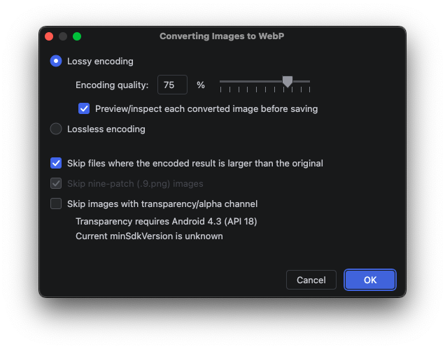

# WebP 관련 리소스

> 본문 정리는 [[Image] WebP 포맷 정리](../ComputerScience/Image/[Image]%20WebP%20포맷%20정리.md) 참고

## Android Studio: 이미지를 WebP로 변환

Android Studio는 프로젝트 내 PNG 이미지를 우클릭하여 바로 WebP로 변환하는 기능을 제공합니다.

1. 변환할 이미지에서 우클릭 → **Convert to WebP...** 선택

2. 인코딩 옵션(손실/무손실, 품질 등)을 설정한 뒤 변환

- **Lossy encoding**: 품질(0~100%)을 조절해 손실 압축, 기본값 75%
- **Lossless encoding**: 무손실 압축
- **Skip files where the encoded result is larger than the original**: 변환 후 용량이 더 커지면 건너뜀
- 알파 채널(투명도) 지원 여부는 `minSdkVersion`에 따라 달라짐 (API 18 미만은 투명도 미지원)
